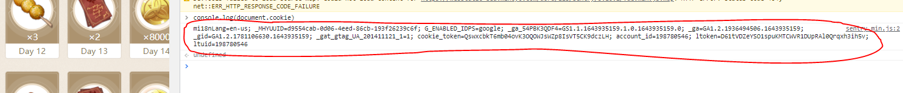

# Daily genshin and honkai login

Auto browser checkin everday at 1am GMT +8

How to setup:

1. ) clone this repository

> git clone -b auto-login --single-branch https://github.com/planktonfun/genshin-team-check.git

2. ) create and push it to your own repository

3.) get browser cookie from checkin page https://webstatic-sea.mihoyo.com/ys/event/signin-sea/index.html?act_id=e202102251931481&lang=en-us

Login then

Go to the browser console then

> console.log(document.cookie)

copy the output

3.) setup secrets variable

Github > Settings > Secrets > Actions > New repository secret

Add MIHOYO_COOKIE then paste the cookie

4.) test workflow

Github > Actions > Daily Login > run workflow

test if it works, if it does, it automatically runs every 1am

